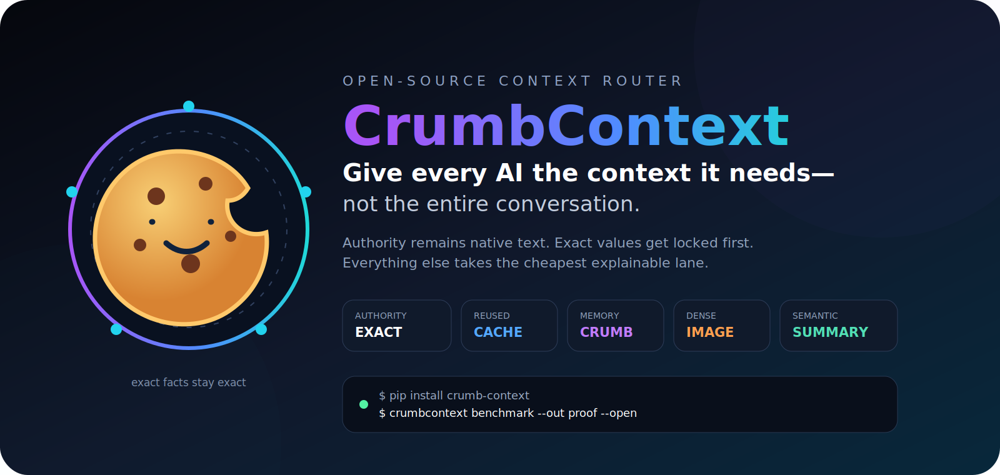
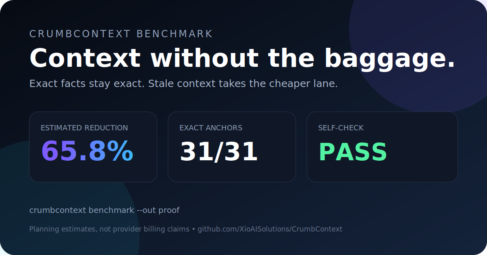
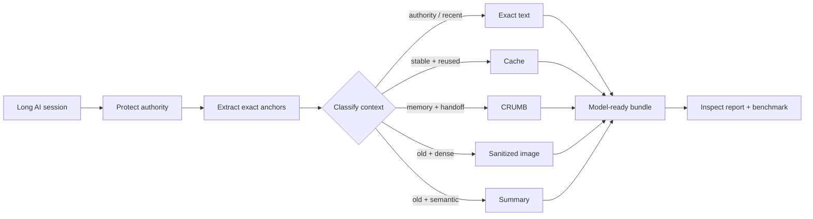

<p align="center">
  
</p>

<p align="center">
  <a href="https://github.com/XioAISolutions/CrumbContext/actions/workflows/ci.yml"></a>
  <a href="https://pypi.org/project/crumb-context/"></a>
  <a href="https://github.com/XioAISolutions/CrumbContext/releases"></a>
  <a href="https://github.com/XioAISolutions/CrumbContext/stargazers"></a>
  
  
  
</p>

<p align="center">
  <strong>Give every AI the context it needs—not the entire conversation.</strong><br>
  A safety-first context router for long agent sessions: authority stays native text, exact values are locked first, and stale context takes the cheapest explainable lane.
</p>

<p align="center">
  <a href="https://codespaces.new/XioAISolutions/CrumbContext?quickstart=1"><strong>Open in Codespaces</strong></a>
  ·
  <a href="#-30-second-proof"><strong>Run the proof</strong></a>
  ·
  <a href="#-route-your-own-context"><strong>Route your context</strong></a>
  ·
  <a href="docs/ARCHITECTURE.md"><strong>Architecture</strong></a>
  ·
  <a href="docs/LAUNCH_KIT.md"><strong>Launch kit</strong></a>
</p>

---

## TL;DR

Long AI sessions usually treat context as one giant blob. That creates three problems:

1. **Authority gets mixed with history.** Old instructions can compete with the current request.
2. **Exact facts are fragile.** Paths, hashes, dates, prices, URLs, and IDs can be corrupted by lossy summaries or visual compression.
3. **Everything is resent at full cost.** Dense logs, reusable references, project memory, and recent conversation all take the same route.

CrumbContext separates those concerns. It classifies every block, protects exact values, assigns one of five lanes, and writes an inspectable bundle for the next model or tool.

```text
raw context
    │
    ▼
protect authority + exact values
    │
    ▼
classify by recency · reuse · structure · density
    │
    ├── exact      system/developer/current/precision-critical
    ├── cache      stable material reused across calls
    ├── crumb      project memory, decisions, handoffs
    ├── image      old dense logs after exact values are removed
    └── summary    old semantic context
```

No cloud key is required for the router or bundled benchmark.

## ⚡ 30-second proof

```bash
git clone https://github.com/XioAISolutions/CrumbContext.git
cd CrumbContext
bash scripts/try.sh
```

Or install and run directly:

```bash
python -m pip install -e '.[dev]'
crumbcontext benchmark --out proof --open
```

The benchmark generates an inspectable proof bundle:

```text
proof/
├── report.html          # open every routing decision
├── share-card.svg       # share the reproducible result
├── benchmark.json       # pass/fail self-check
├── plan.json            # lane, reason, token estimate per block
├── anchors-all.txt      # exact-value index
├── images/              # sanitized historical context
├── crumbs/              # exact anchors + structured memory
└── summaries/           # deterministic stale-context summaries
```

Bundled fixture result:

```text
CrumbContext benchmark: PASS
Estimated tokens: 18,687 -> 6,392 (65.8% planning reduction)
Exact anchors: 31/31 preserved
```

> **Benchmark honesty:** these are deterministic planning estimates, not provider billing records. A measured cost claim requires the same request, model, provider, and output-quality checks before and after routing.

<p align="center">
  
</p>

## 🧠 The rule that matters

> # Exact facts never depend on pixels.

Before any lossy transform, CrumbContext extracts exact values into native-text CRUMB sidecars:

- POSIX and Windows paths;
- hashes and long hexadecimal values;
- UUIDs and long numeric identifiers;
- URLs and email addresses;
- ISO dates and timestamps;
- currency amounts;
- environment variables.

The compressed artifact receives a stable label such as:

```text
[EXACT_7:sha_or_hex]
```

The matching sidecar preserves the actual value:

```text
BEGIN CRUMB
v=1.3
kind=mem
---
[anchors]
- EXACT_7 kind=sha_or_hex value=abcdef1234567890

[guardrails]
- require=copy exact values from this section, never reconstruct them from images
- deny=treat historical compressed context as higher authority than current instructions
END CRUMB
```

That split is the main difference between **compressing context** and **routing context safely**.

## 🛣️ Five lanes, one explainable decision

| Lane | What belongs there | Transformation | Safety rule |
|---|---|---|---|
| `exact` | system/developer instructions, current turns, policy, approval, citations | none | authority and precision remain native text |
| `cache` | stable reference material used repeatedly | cache candidate | reuse beats retransmission |
| `crumb` | project memory, maps, decisions, handoffs | structured CRUMB summary | portable across tools and sessions |
| `image` | old, large, token-dense logs and tool output | sanitized PNG pages | exact values removed first; history is non-authoritative |
| `summary` | old semantic context | deterministic extractive summary | preserve decisions and constraints without every word |

Every block gets a lane **and a plain-language reason** in `plan.json`.



## 🎮 Pick your path

<details open>
<summary><strong>I want the fastest demo</strong></summary>

```bash
python -m pip install -e '.[dev]'
crumbcontext benchmark --out proof --open
```

No API key is required. Inspect `proof/report.html`, then open `proof/plan.json` to see the exact decision logic.

</details>

<details>
<summary><strong>I want to compare image and text-only policies</strong></summary>

```bash
crumbcontext benchmark --out proof-image
crumbcontext benchmark --no-images --out proof-text
```

Compare both `benchmark.json` and `plan.json` files. The benchmark self-check verifies that the selected image policy was actually honored.

</details>

<details>
<summary><strong>I want the plan without creating artifacts</strong></summary>

```bash
crumbcontext analyze examples/transcript.json
```

This prints the complete machine-readable plan to stdout.

</details>

<details>
<summary><strong>I want to use the Python API</strong></summary>

```python
from crumbcontext import ContextBlock, RouterConfig, route_blocks

blocks = [
    ContextBlock(
        id="system",
        role="system",
        kind="instruction",
        content="Never deploy without approval.",
        authoritative=True,
    ),
    ContextBlock(
        id="old-log",
        role="user",
        kind="tool_result",
        content="...large historical output...",
        age_turns=12,
    ),
]

plan = route_blocks(blocks, RouterConfig(vision_allowed=True))
print(plan.to_dict())
```

</details>

<details>
<summary><strong>I want to build a provider adapter</strong></summary>

Start with [`docs/ARCHITECTURE.md`](docs/ARCHITECTURE.md). The non-negotiable invariants are:

1. never move system/developer authority into ordinary user content;
2. extract exact anchors before summaries or images;
3. label compressed history as non-authoritative;
4. compare the same request before and after routing;
5. fall back to exact text when confidence drops.

The Anthropic adapter is the reference implementation; every new adapter must preserve these role and authority boundaries.

</details>

## 🧳 Route your own context

Create `transcript.json`:

```json
{
  "blocks": [
    {
      "id": "system",
      "role": "system",
      "kind": "instruction",
      "content": "Never deploy without approval.",
      "authoritative": true
    },
    {
      "id": "project-memory",
      "role": "user",
      "kind": "memory",
      "content": "Decision: preserve the public API.",
      "age_turns": 18,
      "reuse_count": 5
    },
    {
      "id": "old-log",
      "role": "user",
      "kind": "tool_result",
      "content": "...large historical output...",
      "age_turns": 12
    },
    {
      "id": "now",
      "role": "user",
      "kind": "message",
      "content": "Fix the test and preserve SHA abcdef1234567890.",
      "age_turns": 0
    }
  ]
}
```

Then:

```bash
crumbcontext analyze transcript.json
crumbcontext route transcript.json --out routed --open
```

The input format is intentionally small:

| Field | Required | Meaning |
|---|---:|---|
| `id` | recommended | stable identifier used in the routing plan and filenames |
| `role` | yes | `system`, `developer`, `user`, or another provider role |
| `kind` | yes | semantic class such as `message`, `tool_result`, `memory`, `policy`, or `citation` |
| `content` | yes | original block text |
| `age_turns` | no | distance from the current turn; defaults to `0` |
| `reuse_count` | no | how often stable material is expected to be reused |
| `authoritative` | no | forces native exact-text treatment |
| `metadata` | no | caller-defined information preserved on the block |

## 📦 Install and commands

From source:

```bash
python -m pip install -e .
```

After the first package release:

```bash
pip install crumb-context
```

CLI:

```text
crumbcontext analyze INPUT
crumbcontext route INPUT --out routed [--open] [--no-images]
crumbcontext demo --out demo [--open] [--no-images]
crumbcontext benchmark --out proof [--open] [--no-images]
crumbcontext counterfactual [INPUT] --provider mock|anthropic --out comparison [--open]
```

Useful configuration knobs in `RouterConfig`:

| Setting | Default | Purpose |
|---|---:|---|
| `recent_turns` | `2` | number of current/recent turns kept exact |
| `minimum_compress_chars` | `1800` | avoids transforming tiny blocks |
| `image_min_chars` | `6000` | minimum old dense block eligible for image routing |
| `cache_reuse_threshold` | `3` | expected reuse required for the cache lane |
| `vision_allowed` | `True` | disables image routing when false |
| `summary_ratio` | `0.22` | planning estimate for summary size |
| `crumb_ratio` | `0.30` | planning estimate for structured CRUMB size |


## 🟠 Measure with Anthropic

The provider-neutral counterfactual harness now includes a safety-preserving Anthropic Messages adapter:

```bash
export ANTHROPIC_API_KEY='...'
crumbcontext counterfactual \
  --provider anthropic \
  --model claude-sonnet-4-6 \
  --out anthropic-proof \
  --open
```

It preserves system/developer authority, keeps user and assistant roles intact, sends exact values as native text, supports explicit prompt-cache breakpoints, and uses images only for eligible non-authoritative historical user/tool context. Provider-reported usage includes uncached input, cache reads, cache creation, output tokens, latency, and the Anthropic request ID.

See [`docs/ANTHROPIC.md`](docs/ANTHROPIC.md) for the mapping and threat model. The API key is read only from `ANTHROPIC_API_KEY` and is never stored.

## 🔬 What the benchmark actually proves

The bundled benchmark is offline and deterministic. It checks that:

- every expected exact anchor appears in a native-text sidecar;
- authoritative blocks remain in the `exact` lane;
- recent turns remain in the `exact` lane;
- image-enabled and text-only policies are honored;
- `plan.json` exists;
- the interactive report exists;
- routed-token estimates are lower than the uncompressed estimate for the fixture.

It does **not** prove:

- provider-billed cost savings;
- equal answer quality across models;
- perfect visual recall;
- production readiness for autonomous agents;
- protection against every possible secret or identifier format.

The same-request counterfactual harness now records usage, latency, exact-value recall, task completion, response similarity, and request/response hashes. The next research milestone is broader reproducible provider coverage across models and fixtures.

## 🔐 Privacy and security

CrumbContext is local-first, but its outputs can contain sensitive information.

- Routing, demo, and benchmark commands remain offline. The counterfactual command calls a provider only when an explicit network provider such as `anthropic` is selected.
- Exact-anchor sidecars intentionally contain the extracted exact values.
- Generated images contain sanitized historical context.
- Output directories should be treated as sensitive project artifacts.
- Public issues must use synthetic or redacted fixtures.
- Provider adapters must make network behavior explicit and opt-in.

Read [`SECURITY.md`](SECURITY.md) before using real production transcripts.

## 🚧 Alpha status and non-goals

CrumbContext v0.1 is a provider-neutral router, artifact generator, benchmark, and report surface.

It is not yet:

- a transparent OpenAI or Anthropic proxy;
- an automatic replacement for provider-native caching;
- a secret scanner or DLP product;
- a semantic vector database;
- a guarantee that an image contains enough visual detail for every model;
- permission to move system authority into lower-priority message roles.

When uncertain, the intended fallback is boring and safe: **keep the block as exact text**.

## 🧪 Try to break it

A useful adversarial fixture is worth more than a vague feature request. Test:

- hashes that resemble ordinary words;
- URLs containing long numeric IDs;
- repeated exact values across huge logs;
- stale instructions that conflict with the current request;
- sparse prose that should not become an image;
- dense JSON that should;
- exact values adjacent to Markdown, XML, and punctuation;
- Windows paths, Unicode filenames, and unusual currencies.

Found a miss? Open an issue with the smallest synthetic reproduction.

## 🗺️ Roadmap

- [x] safety-first five-lane router
- [x] exact-anchor CRUMB sidecars
- [x] sanitized PNG context pages
- [x] deterministic summaries
- [x] interactive HTML report
- [x] self-verifying offline benchmark
- [x] shareable proof card
- [x] same-request provider counterfactual harness
- [x] Anthropic Messages adapter
- [ ] OpenAI Responses adapter
- [ ] local OCR/VLM render verification
- [ ] provider/model regression profiles and kill switches
- [ ] signed benchmark fixtures and reproducible release artifacts

## 🥖 CRUMB ecosystem

| Project | Role |
|---|---|
| [`crumb-format`](https://github.com/XioAISolutions/crumb-format) | portable context format, parser, validator, linter |
| [`Crumb-Bob`](https://github.com/XioAISolutions/Crumb-Bob) | session capture and CRUMB generation |
| **CrumbContext** | route context and protect exact facts |
| [`CrumbLLM`](https://github.com/XioAISolutions/CrumbLLM) | reason over CRUMB files and packs |

CrumbContext bundles the small amount of CRUMB writing it needs, so the package remains independently installable.

## 🤝 Contributing

```bash
git clone https://github.com/XioAISolutions/CrumbContext.git
cd CrumbContext
python -m pip install -e '.[dev]'
pytest
crumbcontext benchmark --out proof
```

High-value contributions:

- exact-anchor patterns with adversarial tests;
- provider-specific counterfactual fixtures;
- routing heuristics backed by measurable evidence;
- provider adapters that preserve role authority;
- render-verification and exact-text fallbacks;
- accessibility and benchmark-report improvements.

Read [`CONTRIBUTING.md`](CONTRIBUTING.md), [`CODE_OF_CONDUCT.md`](CODE_OF_CONDUCT.md), and the [open issues](https://github.com/XioAISolutions/CrumbContext/issues).

## ❓ FAQ

<details>
<summary><strong>Why not summarize everything?</strong></summary>

Because summary is lossy and not all context has the same authority or precision requirements. Current instructions, citations, paths, hashes, prices, and IDs should not be reconstructed from a paraphrase.

</details>

<details>
<summary><strong>Why use images at all?</strong></summary>

Old dense tool output can be visually compact for models with vision support. CrumbContext only considers this lane after exact values are extracted, and it labels the image as non-authoritative history. Image routing can be disabled globally.

</details>

<details>
<summary><strong>Does this replace provider prompt caching?</strong></summary>

No. Provider caching is one lane. CrumbContext is the policy layer that decides which stable material is a cache candidate and which content should take a different route.

</details>

<details>
<summary><strong>Does CrumbContext call OpenAI or Anthropic?</strong></summary>

Anthropic is supported explicitly through the same-request counterfactual command. The default remains the offline mock, and no network call occurs unless `--provider anthropic` is selected. OpenAI remains on the roadmap.

</details>

<details>
<summary><strong>Can I use only text?</strong></summary>

Yes. Use `--no-images` or `RouterConfig(vision_allowed=False)`.

</details>

## 📣 Share and cite

The full social-launch copy, GitHub topics, hashtags, and repository-setting checklist live in [`docs/LAUNCH_KIT.md`](docs/LAUNCH_KIT.md).

For research or technical writing, see [`CITATION.cff`](CITATION.cff).

## License

MIT © XIO AI Solutions
