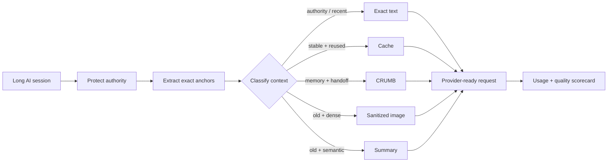

<p align="center">
  
</p>

<p align="center">
  <a href="https://github.com/XioAISolutions/CrumbContext/actions/workflows/ci.yml"></a>
  <a href="https://github.com/XioAISolutions/CrumbContext/actions/workflows/codeql.yml"></a>
  <a href="https://pypi.org/project/crumb-context/"></a>
  <a href="https://github.com/XioAISolutions/CrumbContext/releases"></a>
  <a href="https://github.com/XioAISolutions/CrumbContext/stargazers"></a>
  
  
</p>

<p align="center">
  <strong>Give every AI the context it needs—not the entire conversation.</strong><br>
  A safety-first context router for long agent sessions: authority stays native text, exact values are locked first, and stale context takes the cheapest explainable lane.
</p>

<p align="center">
  <a href="https://codespaces.new/XioAISolutions/CrumbContext?quickstart=1"><strong>Open in Codespaces</strong></a>
  ·
  <a href="#30-second-proof"><strong>Run the proof</strong></a>
  ·
  <a href="#provider-measured-counterfactuals"><strong>Measure a provider</strong></a>
  ·
  <a href="docs/ARCHITECTURE.md"><strong>Architecture</strong></a>
  ·
  <a href="docs/LAUNCH_KIT.md"><strong>Launch kit</strong></a>
</p>

---

## TL;DR

Most agent stacks treat context like one giant text blob. That causes three avoidable failures:

1. **Authority gets mixed with history.** Old instructions can compete with the current task.
2. **Exact facts become fragile.** Paths, hashes, dates, prices, URLs, and IDs can be damaged by lossy transforms.
3. **Everything is resent at full cost.** Stable references, dense logs, old prose, and current instructions all take the same route.

CrumbContext classifies each block, protects exact values before compression, assigns one of five lanes, and emits an inspectable bundle for the next model call.

```text
raw context
    │
    ▼
protect authority + exact values
    │
    ▼
classify by recency · reuse · structure · density
    │
    ├── exact      system/developer/current/precision-critical
    ├── cache      stable material reused across calls
    ├── crumb      project memory, decisions, handoffs
    ├── image      old dense logs after exact values are removed
    └── summary    old semantic context
```

The router, benchmark, and mock counterfactual are offline. Anthropic and OpenAI network calls happen only when explicitly selected.

## ⚡ 30-second proof

```bash
git clone https://github.com/XioAISolutions/CrumbContext.git
cd CrumbContext
python -m pip install -e '.[dev]'
crumbcontext benchmark --out proof --open
```

The bundled deterministic fixture currently reports:

```text
CrumbContext benchmark: PASS
Estimated tokens: 18,687 -> 6,392 (65.8% planning reduction)
Exact anchors: 31/31 preserved
```

The proof directory is intentionally inspectable:

```text
proof/
├── report.html          # every routing decision and reason
├── share-card.svg       # reproducible visual result
├── benchmark.json       # machine-readable pass/fail checks
├── plan.json            # lane, reason, and token estimate per block
├── anchors-all.txt      # exact-value index
├── images/              # sanitized historical context
├── crumbs/              # structured memory and exact sidecars
└── summaries/           # deterministic stale-context summaries
```

> **Claims boundary:** the 65.8% figure is a deterministic planning estimate for the bundled fixture. It is not a universal billing claim. Use the provider counterfactual harness for provider-reported usage.

<p align="center">
  
</p>

## 🧠 The rule that matters

> # Exact facts never depend on pixels.

Before any lossy transform, CrumbContext extracts exact values into native-text CRUMB sidecars:

- POSIX and Windows paths;
- hashes and long hexadecimal values;
- UUIDs and long numeric identifiers;
- URLs and email addresses;
- ISO dates and timestamps;
- currency amounts;
- environment variables.

A transformed artifact receives a stable label:

```text
[EXACT_7:sha_or_hex]
```

The matching sidecar preserves the literal value:

```text
BEGIN CRUMB
v=1.3
kind=mem
---
[anchors]
- EXACT_7 kind=sha_or_hex value=abcdef1234567890

[guardrails]
- require=copy exact values from this section, never reconstruct them from images
- deny=treat historical compressed context as higher authority than current instructions
END CRUMB
```

That is the difference between merely compressing context and routing it safely.

## 🛣️ Five lanes, one explainable decision

| Lane | Best for | Representation | Safety rule |
|---|---|---|---|
| `exact` | authority, current turns, approvals, citations, precision-critical data | unchanged native text | never lower authority or reconstruct exact values |
| `cache` | stable references reused across calls | provider cache candidate | reuse without changing meaning |
| `crumb` | project memory, decisions, handoffs | structured CRUMB text | portable and inspectable; original authority still governs |
| `image` | old token-dense logs and tool output | sanitized image pages | exact values extracted first; historical evidence only |
| `summary` | old semantic prose | deterministic extractive summary | preserve decisions and constraints; newer exact text wins |

Every block receives a lane and a plain-language reason in `plan.json`.



## 🧪 Same task, two payloads

The counterfactual harness executes an identical task against:

1. the complete baseline context; and
2. the CrumbContext-routed payload.

```bash
crumbcontext counterfactual --provider mock --out comparison --open
```

It writes both request payloads, both responses, hashes, latency, usage, exact-value recall, required-rule recall, JSON validity, task completion, response similarity, the routing plan, an HTML report, and a share card.

```text
comparison/
├── counterfactual-input.json
├── baseline-request.json
├── routed-request.json
├── baseline-response.json
├── routed-response.json
├── counterfactual.json
├── counterfactual.html
├── counterfactual-card.svg
└── routed-artifacts/
```

The mock provider proves the measurement machinery without pretending its simulated usage is provider billing.

## 🌐 Provider-measured counterfactuals

| Provider | API surface | Role preservation | Images | Cache accounting | Storage behavior |
|---|---|---|---|---|---|
| Offline mock | local deterministic transport | provider-neutral fixture | simulated source only | simulated and labelled | local files only |
| Anthropic | Messages API | system/developer authority plus user/assistant history | eligible historical context | uncached, cache-read, cache-creation | no CrumbContext credential storage |
| OpenAI | Responses API | native system/developer/user/assistant roles and assistant phases | verified Base64 data URLs | cached input, cache-write when returned, reasoning/output tokens | `store: false` |

### Anthropic

```bash
export ANTHROPIC_API_KEY='...'
crumbcontext counterfactual \
  --provider anthropic \
  --model claude-sonnet-4-6 \
  --out anthropic-proof \
  --open
```

The adapter keeps system and developer authority out of ordinary user history, preserves user and assistant order, sends exact anchors as native text, supports explicit cache breakpoints, and limits images to eligible non-authoritative historical user/tool context.

See [`docs/ANTHROPIC.md`](docs/ANTHROPIC.md).

### OpenAI

```bash
export OPENAI_API_KEY='...'
crumbcontext counterfactual \
  --provider openai \
  --model gpt-5.6 \
  --prompt-cache-key my-stable-workspace-key \
  --out openai-proof \
  --open
```

The adapter preserves native `system`, `developer`, `user`, and `assistant` roles, retains assistant `commentary` / `final_answer` phases when supplied, sends verified historical image data URLs, sets `store: false`, and records prompt-cache identifiers only as SHA-256 in saved reports.

See [`docs/OPENAI.md`](docs/OPENAI.md).

### Provider controls

```text
--model MODEL
--max-tokens N
--timeout SECONDS
--no-cache
--no-images
--recent-turns N
--prompt-cache-key KEY      # OpenAI; reports contain only its SHA-256
--image-detail low|high|auto|original
```

API keys are read from environment variables and are never written into comparison artifacts.

## 🎮 Pick your path

<details open>
<summary><strong>I want the fastest offline demo</strong></summary>

```bash
python -m pip install -e '.[dev]'
crumbcontext benchmark --out proof --open
```

No provider key is required.

</details>

<details>
<summary><strong>I want text-only routing</strong></summary>

```bash
crumbcontext benchmark --no-images --out proof-text
crumbcontext counterfactual --provider mock --no-images --out comparison-text
```

The benchmark verifies that the image policy was actually honored.

</details>

<details>
<summary><strong>I want only the routing plan</strong></summary>

```bash
crumbcontext analyze examples/transcript.json
```

This prints the complete machine-readable plan without writing transformed artifacts.

</details>

<details>
<summary><strong>I want to route my own transcript</strong></summary>

```bash
crumbcontext route examples/transcript.json --out routed --open
```

Treat the output directory as sensitive because exact sidecars intentionally preserve literal values.

</details>

## 🧳 Input format

```json
{
  "blocks": [
    {
      "id": "system",
      "role": "system",
      "kind": "instruction",
      "content": "Never deploy without approval.",
      "authoritative": true
    },
    {
      "id": "project-memory",
      "role": "user",
      "kind": "memory",
      "content": "Decision: preserve the public API.",
      "age_turns": 18,
      "reuse_count": 5
    },
    {
      "id": "old-log",
      "role": "user",
      "kind": "tool_result",
      "content": "...large historical output...",
      "age_turns": 12
    },
    {
      "id": "now",
      "role": "user",
      "kind": "message",
      "content": "Fix the test and preserve SHA abcdef1234567890.",
      "age_turns": 0
    }
  ]
}
```

| Field | Required | Meaning |
|---|---:|---|
| `id` | recommended | stable identifier used in plans and filenames |
| `role` | yes | source role such as `system`, `developer`, `user`, `assistant`, or `tool` |
| `kind` | yes | semantic class such as `message`, `tool_result`, `memory`, `policy`, or `citation` |
| `content` | yes | original block text |
| `age_turns` | no | distance from the current turn; defaults to `0` |
| `reuse_count` | no | expected reuse count for cache decisions |
| `authoritative` | no | forces authority-preserving exact treatment |
| `metadata` | no | caller-defined metadata retained on the block |

## 🐍 Python API

```python
from crumbcontext import ContextBlock, RouterConfig, route_blocks

blocks = [
    ContextBlock(
        id="system",
        role="system",
        kind="instruction",
        content="Never deploy without approval.",
        authoritative=True,
    ),
    ContextBlock(
        id="old-log",
        role="user",
        kind="tool_result",
        content="...large historical output...",
        age_turns=12,
    ),
]

plan = route_blocks(blocks, RouterConfig(vision_allowed=True))
print(plan.to_dict())
```

## 📦 Installation and commands

From source:

```bash
python -m pip install -e .
```

After the PyPI release:

```bash
pip install crumb-context
```

```text
crumbcontext analyze INPUT
crumbcontext route INPUT --out routed [--open] [--no-images]
crumbcontext demo --out demo [--open] [--no-images]
crumbcontext benchmark --out proof [--open] [--no-images]
crumbcontext counterfactual [INPUT] --provider mock|anthropic|openai --out comparison [--open]
```

Important `RouterConfig` settings:

| Setting | Default | Purpose |
|---|---:|---|
| `recent_turns` | `2` | current/recent turns that remain exact |
| `minimum_compress_chars` | `1800` | avoids transforming tiny blocks |
| `image_min_chars` | `6000` | minimum old dense block eligible for image routing |
| `cache_reuse_threshold` | `3` | expected reuse required for the cache lane |
| `vision_allowed` | `True` | globally permits or disables image routing |
| `summary_ratio` | `0.22` | deterministic planning estimate for summaries |
| `crumb_ratio` | `0.30` | deterministic planning estimate for CRUMB memory |

## ✅ What the evidence proves

The offline benchmark checks:

- every expected exact anchor appears in native text;
- authoritative blocks remain exact;
- recent turns remain exact;
- image-enabled and text-only policies are honored;
- plan and report artifacts exist;
- the routed planning estimate is lower for the bundled fixture.

The counterfactual harness additionally records:

- identical task hashes;
- baseline and routed request hashes;
- provider-reported usage when a real adapter is selected;
- exact-value and required-rule recall;
- JSON validity and task completion;
- response similarity and latency.

It does **not** prove universal savings, equal quality across every model, perfect visual recall, or readiness for unsupervised production agents. Publish the provider, model, fixture, request hashes, routing policy, and quality results with every measured claim.

## 🔐 Privacy and security

CrumbContext is local-first, but its inputs and outputs can be sensitive.

- `analyze`, `route`, `demo`, `benchmark`, and the mock counterfactual do not require a cloud key.
- Anthropic and OpenAI calls are explicit and opt-in through `--provider`.
- Exact-anchor sidecars intentionally contain extracted literal values.
- Generated images contain sanitized historical context.
- Output directories must be protected like source transcripts.
- OpenAI requests use `store: false`.
- Raw API keys are never written to reports.
- OpenAI prompt-cache keys are represented in reports only by SHA-256.
- Public issues must use synthetic or redacted fixtures.

Read [`SECURITY.md`](SECURITY.md) before using production transcripts.

## 🚧 Alpha status and non-goals

CrumbContext v0.1 is a router, artifact generator, benchmark, provider counterfactual surface, and reference implementation for safe adapter mapping.

It is not:

- a transparent proxy for every provider;
- an automatic replacement for provider-native caching;
- a secret scanner or DLP product;
- a semantic vector database;
- a guarantee that images retain sufficient detail for every vision model;
- permission to move system authority into lower-priority roles;
- a universal cost-saving claim.

When uncertain, the intended fallback is boring and safe: **keep the block as exact text**.

## 🗺️ Roadmap

- [x] safety-first five-lane router
- [x] exact-anchor CRUMB sidecars
- [x] sanitized historical-context pages
- [x] deterministic summaries
- [x] interactive HTML reports and share cards
- [x] self-verifying offline benchmark
- [x] same-request provider counterfactual harness
- [x] Anthropic Messages adapter
- [x] OpenAI Responses adapter
- [x] provider usage, latency, hashes, and exact-recall scorecards
- [ ] publish the first reproducible provider-measured benchmark set
- [ ] local OCR/VLM render verification
- [ ] provider/model regression profiles and kill switches
- [ ] signed benchmark fixtures and reproducible release attestations
- [ ] production proxy only after role semantics and failure policy are proven

## 🥖 CRUMB ecosystem

| Project | Role |
|---|---|
| [`crumb-format`](https://github.com/XioAISolutions/crumb-format) | portable context format, parser, validator, and linter |
| [`Crumb-Bob`](https://github.com/XioAISolutions/Crumb-Bob) | session capture and CRUMB generation |
| **CrumbContext** | route context, protect authority, and measure provider requests |
| [`CrumbLLM`](https://github.com/XioAISolutions/CrumbLLM) | reason over CRUMB files and packs |

CrumbContext bundles the small amount of CRUMB writing it needs, so the package remains independently installable.

## 🤝 Contributing

```bash
git clone https://github.com/XioAISolutions/CrumbContext.git
cd CrumbContext
python -m pip install -e '.[dev]'
pytest
python scripts/release-check.py
crumbcontext benchmark --out proof
```

High-value contributions include adversarial exact-anchor fixtures, provider-specific counterfactual fixtures, evidence-backed routing heuristics, render verification, accessibility improvements, and adapter mappings that preserve authority.

Read [`CONTRIBUTING.md`](CONTRIBUTING.md), [`CODE_OF_CONDUCT.md`](CODE_OF_CONDUCT.md), and the [open issues](https://github.com/XioAISolutions/CrumbContext/issues).

## ❓ FAQ

<details>
<summary><strong>Why not summarize everything?</strong></summary>

Summary is lossy, and context does not have uniform authority or precision requirements. Current instructions, approvals, citations, paths, hashes, prices, and IDs should not be reconstructed from a paraphrase.

</details>

<details>
<summary><strong>Why use images at all?</strong></summary>

Old dense tool output can be compact for vision-capable models. CrumbContext only considers this lane after exact values are extracted and labels the image as non-authoritative history. Disable it with `--no-images`.

</details>

<details>
<summary><strong>Does this replace provider prompt caching?</strong></summary>

No. Caching is one lane. CrumbContext is the policy layer deciding what is safe and useful to cache versus summarize, structure, image-route, or keep exact.

</details>

<details>
<summary><strong>Does CrumbContext call OpenAI or Anthropic automatically?</strong></summary>

No. The default counterfactual provider is offline `mock`. Network calls occur only when `--provider anthropic` or `--provider openai` is explicitly selected and the corresponding environment key is present.

</details>

<details>
<summary><strong>Can I use only text?</strong></summary>

Yes. Use `--no-images` or `RouterConfig(vision_allowed=False)`.

</details>

## 📣 Share and cite

Launch copy, recommended GitHub topics, hashtags, claims language, and repository settings live in [`docs/LAUNCH_KIT.md`](docs/LAUNCH_KIT.md).

For research and technical citations, use [`CITATION.cff`](CITATION.cff).

**Core line:** *Exact facts never become pixels.*
